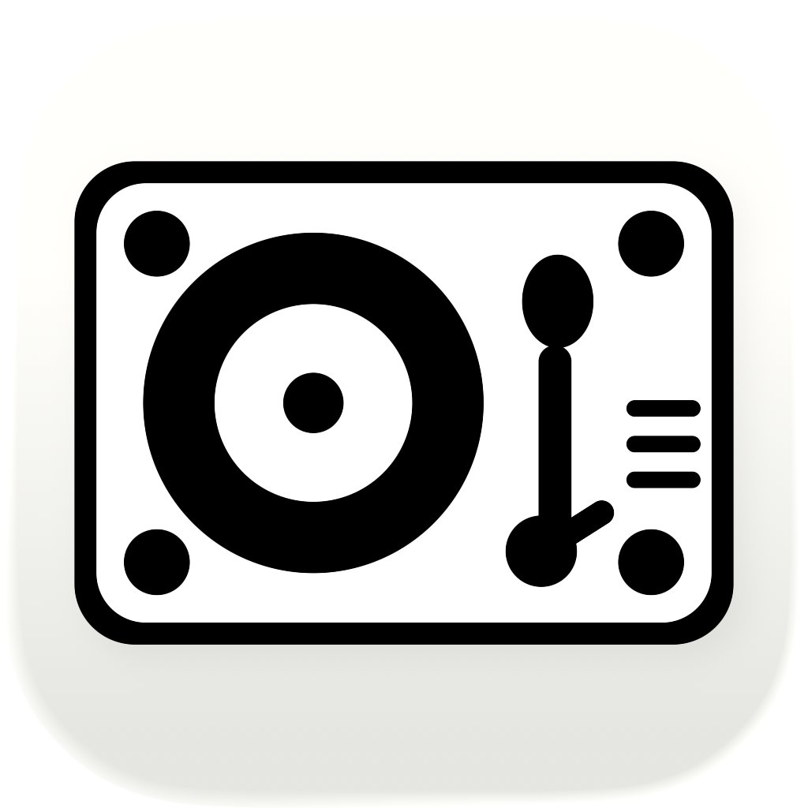

  

  iOS client for <a href="https://github.com/adamchairly/soundfeed">soundfeed</a>

## About

Soundfeed tracks your favorite Spotify artists and displays new releases in a clean, chronological feed.

No login, account or any personal detail required. Optional email for weekly digest.

## Requirements

- iOS 26.0+
- Xcode 16+

## Setup

1. Clone the repository
2. Copy `Environment.plist.example` to `Environment.plist` and fill in the API URL
3. Open `soundfeed.xcodeproj` and run

## License

This project is licensed under the MIT License - see the [LICENSE](./LICENSE) file for details.
